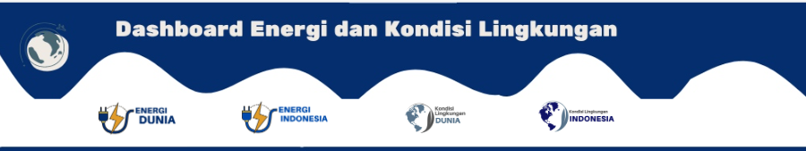
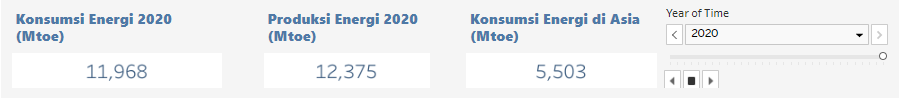
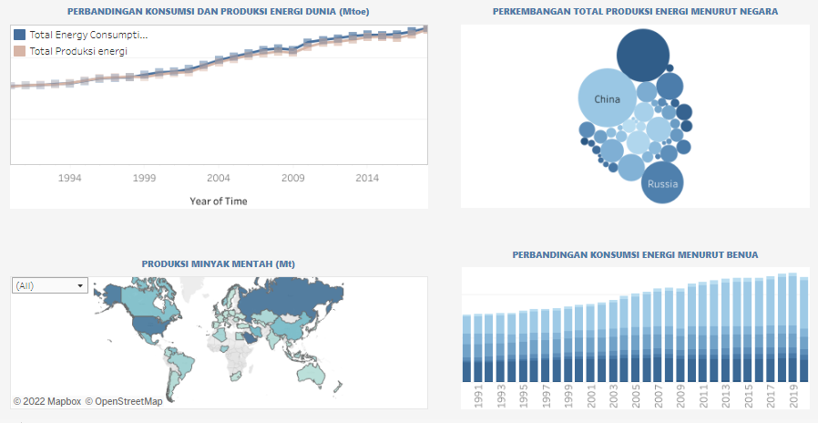

<div id="top"></div>
<!--
*** Thanks for checking out the Best-README-Template. If you have a suggestion
*** that would make this better, please fork the repo and create a pull request
*** or simply open an issue with the tag "enhancement".
*** Don't forget to give the project a star!
*** Thanks again! Now go create something AMAZING! :D
-->


<!-- PROJECT SHIELDS -->
<!--
*** I'm using markdown "reference style" links for readability.
*** Reference links are enclosed in brackets [ ] instead of parentheses ( ).
*** See the bottom of this document for the declaration of the reference variables
*** for contributors-url, forks-url, etc. This is an optional, concise syntax you may use.
*** https://www.markdownguide.org/basic-syntax/#reference-style-links
-->


<!-- PROJECT LOGO -->
<br />
<div align="center">
  <a href="https://github.com/othneildrew/Best-README-Template">
    
  </a>

  <h3 align="center">Energi dan Kondisi Lingkungan</h3>

</div>


<!-- ABOUT THE PROJECT -->
# Implementasi Dashbord Energi dan Kondisi Lingkungan Dunia.

Energi merupakan salah satu aspek penting di kehidupan kita. Jumlah penduduk yang meningkat menjadi pemicu ketergantungan besar terhadap energi. Namun, kebutuhan energi yang besar saat ini masih bertumpu pada sektor energi fosil yang memiliki dampak negatif. Energi yang digunakan ini, termasuk energi tak terbarukan dan tak berkelanjutan. 

Dampak yang ditimbulkan dari penggunaan energi fosil adalah ketika polusi udara yang dihasilkan menyebabkan perubahan iklim. Perubahan iklim merupakan isu besar untuk dunia. Untuk menanggapi isu besar itu, maka terbentuk suatu perjanjian yang disebakati secara global disebut perjanjian Paris.

Perjanjian Paris merupakan kesepakatan tingkat global yang menumental untuk menghadapi perubahan iklim. Perjanjia itu ditindak lanjuti melalui Nationally Determined Contribution untuk periode 2020-2030.

Peubahan iklim menjadi isu yang hangat dibicarakan karena akan berdampak sangat luas untuk seluruh penduduk bumi. Kenaikan suhu bumi, akan berdampak besar dari pada aspek kehidupan. Salah satunya adalah akan menubah sistem iklim yang mempengaruhi berbagai aspek pada peubahan alam dari kehidupan manusia seperti kualita dan kuantitas air, habitat hutan, kesehatan, lahan pertanian dan ekonistem wilayah pesisir.

Maka dari itu, maka tujuan dari project ini adalah ingin melihat bagaimana Energi yang dibandingkan dengan Kondisi Lingkungan yang akan disusun secara visual untuk dapat menerangkan data dengan cepat dan menarik dan akan disusun dalam dashboard.

## KERANGKA PIKIR
berdasarkan uraian dashboard diatas maka disusunlah kerangka pikir seperti pada gambar di bawah ini:
<div align="center">  </div>


## METODE PENELITIAN
<div align="center">
 </div>


## SUMBER DATA
Data dihasilkan dari beberapa sumber dan dikelompokan berdasarkan halaman tampilan dashboard.  Terdapat 4 pengelompokan data yaitu:
1. Data yang menjelaskan mengenai Energi Ruang Lingkup Dunia.
2. Data yang menjelaskan mengenai Energi Ruang Lingkup Indonesia.
3. Data yang menjelaskan mengenai Kondisi Lingkungan Ruang Lingkup Dunia
4. Data yang menjelaskan mengenai Kondisi Lingkungan Ruang Lingkup Indonesia.

### Energi Ruang Lingkup Dunia
Data energi dunia bersumber dari laman enerdata pada hasil publikasinya yang berjudul enrdata energy statistical yearbook 2021 yang diambil pada laman [ENERDATA](https://www.enerdata.net/publications/world-energy-statistics-supply-and-demand.html?gclid=CjwKCAjwtcCVBhA0EiwAT1fY76_yE1d-pdFG089x5WSvTWBtuFvYuSrA-yd11CS5EYVAg_EImNSXyxoCzKYQAvD_BwE) dan hasil data yang di ambil dapat dilihat pada berikut. [DATA](https://docs.google.com/spreadsheets/d/1_6vxiHt3tL2Xx1kD1-0sSzQuWC3-amPH/edit?usp=sharing&ouid=107777554176013803099&rtpof=true&sd=true)


### Energi Ruang Lingkup Indonesia
Data energi dunia bersumber dari laman data [Badan Pusat Statistik](https://www.bps.go.id/subject/7/energi.html#subjekViewTab3) yang terdiri dari data [Persentase Energi Terbarukan](https://www.bps.go.id/indicator/7/1824/1/bauran-energi-terbarukan.html), [Produksi Barang Tambang Mineral](https://www.bps.go.id/indicator/10/508/1/produksi-barang-tambang-mineral.html), dan [Tenaga Listrik yang Dibangkitkan Menurut Provinsi](https://www.bps.go.id/indicator/7/864/1/tenaga-listrik-yang-dibangkitkan-menurut-provinsi.html)

### Kondisi Lingkungan Ruang Lingkup Dunia.
Data dengan kategori ini bersumber dari situs laman Nasa yang memberikan gambaran mengenai prubahan iklim dunia yang di dapat pada laman [nasa](https://climate.nasa.gov/vital-signs/carbon-dioxide/)

### Kondisi Lingkungan Ruang Lingkup Indonesia
Kondisi lingkungan ruang lingkup Indonesia diperoleh dari 2 sumber yaitu [BPS](https://www.bps.go.id/) dan [data.jakarta](https://data.jakarta.go.id/dataset/indeks-standar-pencemaran-udara-ispu-tahun-2021)

Data yang diambil dari data BPS adalah data mengenai Persentase kelayakan air minum Provinsi dengan kategori desa, kota, dan gabungan. Selanjutnya data mengenai Jumlah penduduk miskin, dan sumber air minum layak menurut provinsi.

Sedangkan data yang bersumber data.jakarta merupakan kondisi udara jakarta harian pada tahun 2021. Satu tambahan data yang bersumber dari world bank data yaitu Rata Rata Suhu Tertinggi Menurut Provinsi.

[detail data](https://drive.google.com/drive/folders/1OXpKQn1G3P6kzb5OUi00rmS4gxdhvwtI?usp=sharing)


## SELEKSI DATA
Dari berbagai macam sumber data yang diperoleh, selanjutnya akan dilakukan seleksi data untuk dapat memberikan gambaran suatu fenomena yang terjadi dengan memilih data yang penting yang akan dilakukan proses visualisasi lebih lanjut.

## VISUALISASI DATA
Pemilihan jenis visualisasi penting untuk dapat memberikan gambaran data secara akurat tanpa adanya visualisasi data.

Jenis Visualisasi yang digunakan:
* Line Chart
* Chloropleth map
* Bubble Chart
* Sanked Bar Chart

Berikut alasan pemilihan jenis visualisasi tersebut:

1. Line Chart
Visualisasi ini dipilih untuk menampilkan data runtun waktu untuk melihat perubahan dalam kurun waktu tertentu
2. Chloropleth Map
  Visualisasi ini dipilih untuk dapat menggambarkan keadaan data yang berformat lokasi dan menggunakan gradasi warna untuk dapat membedakan kondisi tiap wilayah tertentu.
3. Bubble Chart
   Bubble Chart ini digunakan untuk melihat perbandingan data dengan menggambarkan perubahan tiap satuan tahun. Maka dari itu pada dahboard penelitian terdapat tombol pause dan play untuk melihat perubahan bubble dari tahun ke tahun.
4. Sanked Bar Chart
   Visualisasi ini dipilih untuk data yang berhierarki. Dalam kasus dashboard energi dan kondisi lingkungan didapati bahwa terdapat hierarki lokasi yaitu dari negara disatukan dalam 1 kawasan benua tertentu. Sehingga perbandingan menggunakan sanked bar chart digunakan dalam visualisasi.

## PENYUSUNAN DASHBOARD
Penyusunan dashboard dimulai dari konsep yang ingin di implementasikan dalam dashboard. Saya mengelompokan 3 bagian dalam dashboard yang ingin direalisasikan yaitu:
*  Header + Menu
<div align="center">
 </div>

*  Highlight Informasi
   <div align="center">
 </div>

* Visualisasi Data.
<div align="center">
 </div>

untuk detail dashboard dapat dilihat pada laman :
  ```sh
  npm install npm@latest -g
  ```